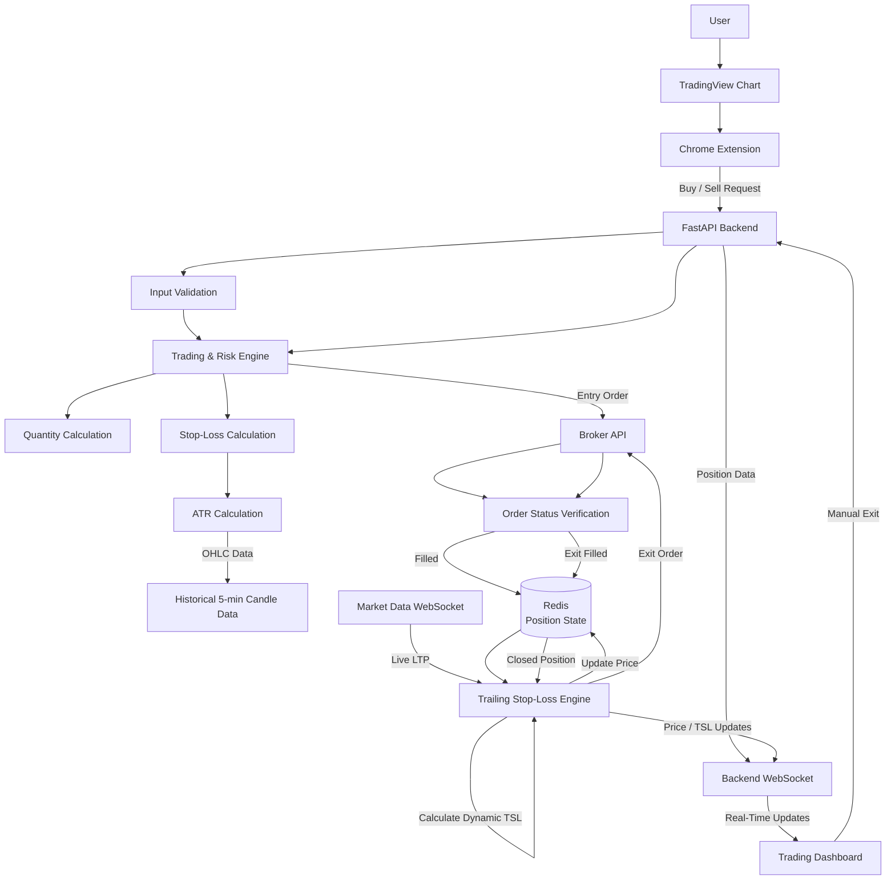

# One-Click Trading Extension for Chart Analysing Platforms 

A browser extension and Python backend that enables one-click trading directly from a TradingView chart.

The system receives Buy/Sell actions from the browser extension, validates the request, calculates position quantity, determines stop-loss levels using ATR or percentage-based rules, executes orders through a broker API, stores live position state in Redis, and continuously monitors market prices for trailing stop-loss exits.

> ⚠️ **Important:** This project is capable of placing real orders on a brokerage account. It is an engineering/learning project and should not be treated as production-grade trading infrastructure or financial advice.

---

## Features

* One-click Buy/Sell workflow from the TradingView interface
* Chrome browser extension with injected trading controls
* Backend REST API using FastAPI
* Input and order validation
* Automatic position quantity calculation based on risk rules
* ATR-based stop-loss calculation
* Percentage-based stop-loss calculation
* Historical 5-minute OHLC candle data for ATR calculation
* Dynamic trailing stop-loss calculation
* Real-time LTP updates through a market-data WebSocket
* Redis-based active position state management
* Broker API integration for entry and exit orders
* Order-status verification before considering an order completed
* Automatic exit when SL/TSL conditions are triggered
* Manual position exit from the frontend
* Real-time frontend updates through a backend WebSocket
* Market-data subscription/unsubscription for active positions
* Docker-based backend environment

---

# System Architecture



### Main flow

1. The user interacts with the TradingView chart.
2. The browser extension captures the Buy/Sell action.
3. The request is sent to the FastAPI backend.
4. The backend validates the input.
5. The trading/risk engine calculates the required quantity and stop-loss parameters.
6. Historical 5-minute candle data is used for ATR-based calculations when required.
7. The entry order is sent to the broker API.
8. The order status is verified before the position is treated as active.
9. Active position state is stored in Redis.
10. The market-data WebSocket continuously provides live LTP.
11. The trailing stop-loss engine updates the position's price, high/low values and dynamic TSL.
12. When the exit condition is reached, an exit order is sent to the broker.
13. The system verifies the exit order.
14. After a successful exit, the position is removed from active state and its market-data subscription is cancelled.
15. Position and price changes are pushed to the frontend through a WebSocket.

---

# Risk & Position Management

The system supports two stop-loss approaches:

### 1. ATR-Based Stop Loss

Historical candle data is used to calculate Average True Range (ATR).

ATR provides a volatility-aware value that can be used to determine an initial stop-loss distance.

```text
Historical 5-min OHLC candles
             ↓
        ATR calculation
             ↓
       ATR component
             ↓
      Initial Stop Loss
```

### 2. Percentage-Based Stop Loss

A fixed percentage can also be used to determine the stop-loss distance from the entry price.

### Trailing Stop Loss

After the position becomes active, the system tracks the relevant price extreme.

For a BUY position:

```text
Highest Price
      ↓
Dynamic Trailing Stop
      ↓
Current LTP
```

For a SELL position, the corresponding lowest-price logic is used.

The TSL engine continuously checks whether the current price has crossed the calculated trailing stop.

---

# Order Lifecycle

```text
Buy/Sell Request
       ↓
Validation
       ↓
Quantity Calculation
       ↓
Stop-Loss Calculation
       ↓
Broker Entry Order
       ↓
Order Status Verification
       ↓
FILLED
       ↓
Active Position
       ↓
Redis
       ↓
Live LTP Monitoring
       ↓
TSL Calculation
       ↓
Exit Condition?
    /       \
   No       Yes
   ↓         ↓
Continue   Exit Order
             ↓
       Status Verification
             ↓
           FILLED
             ↓
       Close Position
             ↓
     Remove Active State
             ↓
   Unsubscribe Market Data
```

---

# Real-Time Communication

The system uses two different real-time flows.

### Market Data WebSocket

The market-data WebSocket provides live LTP updates to the trailing stop-loss engine.

```text
Market Data
     ↓
WebSocket
     ↓
Live LTP
     ↓
TSL Engine
     ↓
Position Update
```

Only active positions should remain subscribed to the required market-data instruments.

### Backend WebSocket

The backend WebSocket sends position changes back to the browser extension/dashboard.

```text
TSL Engine
     ↓
Position / Price / TSL Update
     ↓
Backend WebSocket
     ↓
Browser Extension
     ↓
Trading Dashboard
```

This allows the UI to display updated LTP, stop-loss, trailing stop and position status without repeatedly refreshing the page.

---

# Manual Exit

The user can manually close an active position from the frontend.

```text
Manual Exit
     ↓
FastAPI
     ↓
Broker Exit Order
     ↓
Order Status Verification
     ↓
FILLED
     ↓
Position → CLOSED
     ↓
Delete Active Redis State
     ↓
Unsubscribe Market Data
     ↓
WebSocket Update
     ↓
Frontend Removes Position
```

---

# Technology Stack

| Component               | Technology                      |
| ----------------------- | ------------------------------- |
| Browser UI              | TradingView + Chrome Extension  |
| Frontend Logic          | JavaScript                      |
| Backend                 | Python + FastAPI                |
| Real-Time Communication | WebSocket                       |
| Market Data             | Market Data WebSocket           |
| Position State          | Redis                           |
| Historical Data         | Historical Candle API           |
| Trading                 | Broker REST API                 |
| Containerization        | Docker / Docker Compose         |
| Architecture            | Event-driven + stateful backend |

---

# Engineering Concepts Demonstrated

This project focuses on more than simply sending an API request.

### Backend Engineering

* REST API design
* FastAPI routing
* Pydantic request validation
* Service-layer separation
* Environment-based configuration
* Error handling

### Real-Time Systems

* WebSocket communication
* Live market-data streaming
* Backend-to-frontend event broadcasting
* Event-driven position updates

### State Management

* Redis as a fast active-position store
* Position lifecycle management
* Active/closed state transitions
* Market-data subscription tracking

### Trading & Risk Logic

* Risk-based quantity calculation
* ATR calculation
* Volatility-aware stop loss
* Dynamic trailing stop loss
* Automatic exit conditions
* Manual exit handling

### API Integration

* Broker order placement
* Order-status polling/verification
* Historical candle API integration
* Market-data WebSocket integration

### Infrastructure

* Docker
* Docker Compose
* Environment variables
* Backend containerization

---

# Project Structure

```text
project/
│
├── extension/
│   ├── manifest.json
│   ├── watcher.js
│   ├── ui-render.js
│   └── ...
│
├── backend/
│   ├── main.py
│   ├── routes/
│   ├── services/
│   │   ├── stoploss.py
│   │   ├── broker_service.py
│   │   └── ...
│   │
│   ├── storage/
│   │   └── redis_storage.py
│   │
│   ├── core/
│   │   └── config.py
│   │
│   └── ...
│
├── docker-compose.yml
├── requirements.txt
├── .env.example
└── README.md
```

---

# Setup

## Prerequisites

* Python 3.x
* Redis
* Docker / Docker Compose
* Chrome or Chromium-based browser
* Trading account with API access
* Required API credentials

## Backend

```bash
cd backend

pip install -r requirements.txt

cp .env.example .env
```

Configure the required environment variables in `.env`.

Then start the backend:

```bash
docker compose up --build
```

or run the backend directly:

```bash
python main.py
```

## Extension

Open:

```text
chrome://extensions
```

Then:

1. Enable Developer Mode.
2. Select "Load unpacked".
3. Select the extension directory.
4. Open TradingView.
5. Verify that the extension is connected to the backend.

#

---

# Current Limitations

Known areas requiring further hardening include:

*
* Broker API timeout handling
* WebSocket reconnect/recovery logic
* Market-data subscription lifecycle edge cases
* Race-condition handling during simultaneous exit events
* Comprehensive automated testing
* Production deployment and monitoring

The current implementation primarily manages SL/TSL logic through the backend rather than relying on a broker-side resting stop-loss order.

---

# Roadmap

* [ ] Broker-side SL/GTT backstop
* [ ] Robust partial-fill handling
* [ ] Duplicate-order protection
* [ ] WebSocket reconnect and subscription recovery
* [ ] Automated failure-mode testing
* [ ] Better frontend status/error handling
* [ ] Additional broker adapters
* [ ] Production deployment
* [ ] Monitoring and logging
* [ ] Paper-trading mode

---

# Risk Disclaimer

This project is intended for educational and engineering purposes.

It can interact with real brokerage APIs and may place real orders. Trading involves substantial financial risk, and software failures, incorrect market data, network failures, broker API failures, race conditions, or unexpected execution behavior can result in losses.

Do not use this project with money you cannot afford to lose.

The project is not financial advice.

---

#
